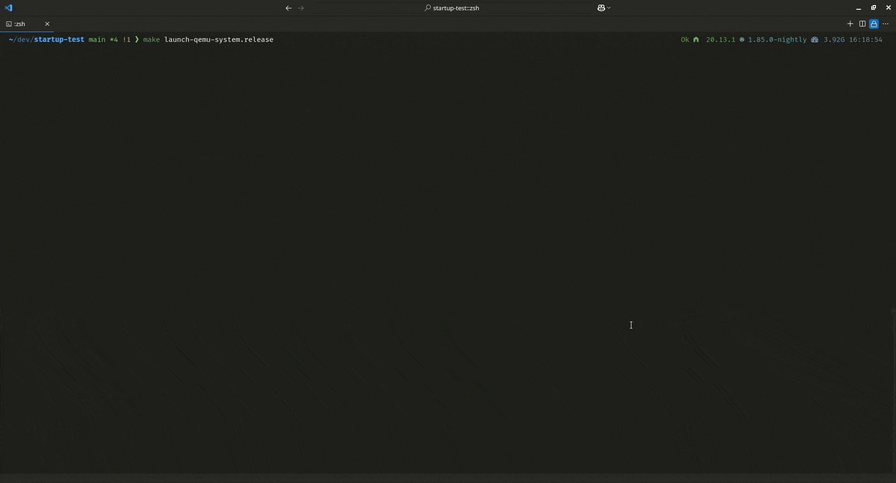
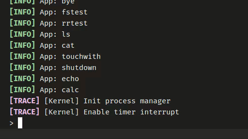
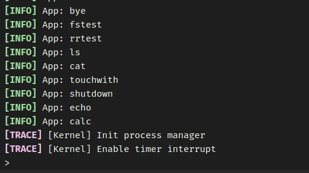
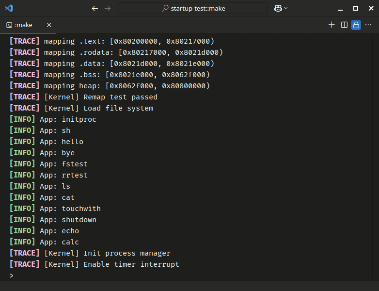

# OSKernel2024-ROS666

从零开始使用 Rust 编写的运行在 RISC-V 架构上的简单类 Unix 操作系统内核实现。

## 比赛信息

项目为 2024 年[2024年全国大学生计算机系统能力大赛-操作系统设计赛(华东区域赛)-OS原理赛道](https://os.educg.net/?token=mFdHhJEk3gYJUVY04cNJCPrCl4h4Nxeu4EEkp6Vszn#/index?TYPE=OS_HDN/#/index?TYPE=OS_HDN)
参赛项目。

- **学校**：合肥工业大学（HFUT）
- **比赛方向**: OS原理赛道/方向一：小型内核实现
- **队伍编号**: T202419359994630
- **队伍名称**: HFUT666
- **团队成员**:
  - 万立志 @MagicalMagic | [GitHub](https://github.com/MagicBeards) | [gitlab.eduxiji.net](https://gitlab.eduxiji.net/MagicalMagic)
  - 高培骏 @FengSheng0804 | [GitHub](https://github.com/FengSheng0804) | [gitlab.eduxiji.net](https://gitlab.eduxiji.net/FengSheng0804)
  - 卢继鹏 @Gerrnperl | [GitHub](https://github.com/Gerrnperl/) | [gitlab.eduxiji.net](https://gitlab.eduxiji.net/gerrnperl)
- **指导老师**:
  - 田卫东
  - 周红鹃

## 参考

项目开发过程主要参考以下资料：
- [rCore-Tutorial-Book-v3](https://rcore-os.cn/rCore-Tutorial-Book-v3/) | [GPL-3.0 License](https://github.com/rcore-os/rCore-Tutorial-Book-v3/blob/main/LICENSE)

部分代码参考以下项目：
- [rCore-Tutorial-v3](https://github.com/rcore-os/rCore-Tutorial-v3) | [GPL-3.0 License](https://github.com/rcore-os/rCore-Tutorial-v3/blob/main/LICENSE)
- [slab_allocator - Slab allocator for no_std systems. ](https://github.com/weclaw1/slab_allocator/tree/master) | [MIT License](https://github.com/weclaw1/slab_allocator/blob/master/LICENSE)
- [virtio-drivers](https://github.com/rcore-os/virtio-drivers) | [MIT License](https://github.com/rcore-os/virtio-drivers/blob/master/LICENSE)

## 文档

- [概述](./docs/概述.md)
- [操作系统启动](./docs/操作系统启动.md)
- [系统陷入](./docs/系统陷入.md)
- [存储管理](./docs/存储管理)
  - [概述](./docs/存储管理/概述.md)
  - [地址](./docs/存储管理/地址.md)
  - [动态内存分配](./docs/存储管理/动态内存分配.md)
  - [物理页帧](./docs/存储管理/物理页帧.md)
  - [多级页表](./docs/存储管理/多级页表.md)
  - [地址空间](./docs/存储管理/地址空间.md)
- [进程管理](./docs/进程管理)
  - [概述](./docs/进程管理/概述.md)
  - [进程控制块](./docs/进程管理/进程控制块.md)
  - [进程状态切换](./docs/进程管理/进程状态切换.md)
  - [进程调度](./docs/进程管理/进程调度.md)
- [文件系统](./docs/文件系统)
  - [概述](./docs/文件系统/概述.md)
  - [块设备接口及缓冲层](./docs/文件系统/块设备接口及缓冲层.md)
  - [磁盘布局与索引节点](./docs/文件系统/磁盘布局与索引节点.md)
  - [文件系统抽象](./docs/文件系统/文件系统抽象.md)
  - [文件和目录管理](./docs/文件系统/文件和目录管理.md)
- [系统调用](./docs/系统调用.md)
- [功能测试](./docs/功能测试.md)

## 进度
- [x] 裸机内核启动
- [x] 标准输入输出
- [x] 陷入与陷入返回
- [x] 动态内存分配 (Slab Allocator)
- [x] 分页机制
- [x] 时钟中断
- [x] 进程管理与调度
- [x] 文件系统
- [x] 用户态程序
- [x] 命令行参数
- [x] 系统调用
  - [x] stdio & fs: read, write; openat, close
  - [x] process: clone(fork), execve, wait, exit, sched_yield
  - [x] gettime, shutdown

## 运行演示

### 启动及关闭系统



### 用户程序



### 进程管理



### 文件系统




## 开发历程

至2024年全国大学生计算机系统能力大赛-操作系统设计赛(华东区域赛)-OS原理比赛结束时，本项目总共经历了260余次修改。具体请参考我们的[commit记录](https://gitlab.eduxiji.net/T202419359994630/project2608132-275917/-/commits/main)

至比赛结束时，本项目共包含约8500行源代码、约6200行markdown文档说明，下表具体展示了组成项目各部分的占比。

| language | files | code | comment | blank | total |
| :--- | ---: | ---: | ---: | ---: | ---: |
| Rust | 79 | 5,119 | 2,291 | 819 | 8,229 |
| Markdown | 29 | 4,724 | 0 | 1,558 | 6,282 |
| TOML | 9 | 158 | 5 | 33 | 196 |
| Assembler file | 3 | 136 | 0 | 22 | 158 |
| Makefile | 1 | 106 | 25 | 25 | 156 |
| Shell Script | 1 | 92 | 36 | 16 | 144 |
| LinkerScript | 2 | 86 | 2 | 12 | 100 |

以下为各个版本完成的工作：
| 版本 | 完成核心任务 | 跳转链接 | 
| :--- | :--- | :--- |
| v0.0.1 | 裸机程序 Hello World | [v0.0.1](https://gitlab.eduxiji.net/T202419359994630/project2608132-275917/-/tags/v0.0.1) | 
| v0.0.2 | 基本用户态程序执行 | [v0.0.2](https://gitlab.eduxiji.net/T202419359994630/project2608132-275917/-/tags/v0.0.2) |
| v0.0.3 | 完善构建脚本和启动配置 | [v0.0.3](https://gitlab.eduxiji.net/T202419359994630/project2608132-275917/-/tags/v0.0.3) | 
| v0.0.4 | 陷入处理与基本系统调用实现、程序加载与批处理 | [v0.0.4](https://gitlab.eduxiji.net/T202419359994630/project2608132-275917/-/tags/v0.0.4) | 
| v0.0.5 | 多道程序加载与动态地址重定位 | [v0.0.5](https://gitlab.eduxiji.net/T202419359994630/project2608132-275917/-/tags/v0.0.5) | 
| v0.0.6 | 多道程序执行、任务切换、协作式调度 | [v0.0.6](https://gitlab.eduxiji.net/T202419359994630/project2608132-275917/-/tags/v0.0.6) |
| v0.0.7 | 时间片轮转与分时多任务 | [v0.0.7](https://gitlab.eduxiji.net/T202419359994630/project2608132-275917/-/tags/v0.0.7) |
| v0.0.8 | 堆分配器、动态内存分配 | [v0.0.8](https://gitlab.eduxiji.net/T202419359994630/project2608132-275917/-/tags/v0.0.8) |
| v0.0.9 | 分页机制、地址空间、ELF程序加载 | [v0.0.9](https://gitlab.eduxiji.net/T202419359994630/project2608132-275917/-/tags/v0.0.9)
| v0.0.10 | 进程管理与进程调度 | [v0.0.10](https://gitlab.eduxiji.net/T202419359994630/project2608132-275917/-/tags/v0.0.10) | 
| v0.0.11 | 文件系统库与文件系统镜像打包工具 | [v0.0.11](https://gitlab.eduxiji.net/T202419359994630/project2608132-275917/-/tags/v0.0.11) | 
| v0.1.0 | 文件系统接入、VirtIO block device 与 SD 卡驱动 | [v0.1.0](https://gitlab.eduxiji.net/T202419359994630/project2608132-275917/-/tags/v0.1.0) | 
| v0.1.1 | 关闭系统、进程让权休眠；完善日志；代码整理优化 | [v0.1.1](https://gitlab.eduxiji.net/T202419359994630/project2608132-275917/-/tags/v0.1.1) | 
| v0.1.2 | 命令行参数；cat、ls、touch 等用户程序 | [v0.1.2](https://gitlab.eduxiji.net/T202419359994630/project2608132-275917/-/tags/v0.1.2) |


## 依赖

项目构建运行配置针对 Linux (Ubuntu) 系统配置，未在其他系统上测试。建议使用 WSL2 或 VMWare / VirtualBox 等虚拟机运行 Ubuntu 系统。

Ubuntu 版本建议在 **24.04 noble** 及以上版本，避免从源码编译 QEMU。

运行 `scripts/check-dev-requirements.sh` 检查开发环境是否满足要求。

### WSL 

参阅:

[Install Ubuntu on WSL2](https://documentation.ubuntu.com/wsl/en/latest/guides/install-ubuntu-wsl2/)

[Ubuntu 24.04.1 LTS | Microsoft Store](https://apps.microsoft.com/detail/9nz3klhxdjp5)

[Developing in WSL with Visual Studio Code](https://code.visualstudio.com/docs/remote/wsl)

### Build-essential

Build-essential 是一个包含了编译 C/C++ 程序所需的工具的包。我们主要使用其中的 Make 工具。

```shell
sudo apt install build-essential
```

### Rust 安装


项目使用 Rust 语言进行开发。确保系统中已安装 Rust 工具链。

#### 安装 Rust

可以通过以下命令安装 Rust：

```shell
curl https://sh.rustup.rs -sSf | sh
```

或者使用镜像站点安装：

```shell
export RUSTUP_DIST_SERVER=https://mirrors.tuna.edu.cn/rustup
export RUSTUP_UPDATE_ROOT=https://mirrors.tuna.edu.cn/rustup/rustup
curl https://sh.rustup.rs -sSf | sh
```

#### 检查 Rust 版本

Rust 1.85.0 版本 / Rust 2024 版本将于 2025-02-20 进入 `stable` 通道。在此之前，我们可能需要使用 Rust 的 `nightly` 版本来编译项目。

确保 Rust 版本 >= 1.85.0。运行以下命令检查版本：

```shell
rustc --version
```

如果版本不满足要求，请安装 `nightly` 版本：

```shell
rustup install nightly
rustup default nightly
```

#### 设置构建目标

项目使用 `riscv64gc-unknown-none-elf` 作为构建目标。运行以下命令设置构建目标：

```shell
rustup target add riscv64gc-unknown-none-elf
cargo install cargo-binutils
rustup component add llvm-tools-preview
rustup component add rust-src
```

#### 配置 Cargo 镜像源

Rust 的包管理工具 `cargo` 默认从官方源下载依赖，由于网络原因可能会导致下载速度较慢。可以配置 Rust 镜像源加速下载。

```toml
# ~/.cargo/config.toml
[source.crates-io]
replace-with = 'mirror'

[source.mirror]
registry = "https://mirrors.tuna.tsinghua.edu.cn/git/crates.io-index.git"
```

### QEMU 安装

项目使用 QEMU System RISC-V 模拟器运行 RISC-V 架构的内核, 使用 QEMU RISC-V 模拟器测试用户态程序。

#### 安装 QEMU

对于 Ubuntu >= 23.04，可以通过以下命令安装 QEMU（>= 7.0.0）：

```shell
sudo apt install qemu-system
sudo apt install qemu-user
```

对于旧版本的 Ubuntu，需要从源码编译 QEMU。请参考以下链接：

- [rCore-Tutorial-Book-v3](https://rcore-os.cn/rCore-Tutorial-Book-v3/chapter0/5setup-devel-env.html#qemu)
- [QEMU 官方下载页面](https://www.qemu.org/download/#source)

#### 检查 QEMU 版本

确保 QEMU 版本 >= 7.0.0。运行以下命令检查版本：

```shell
qemu-system-riscv64 --version
```

### riscv64-*-gdb 安装

需要安装 `riscv64-unknown-elf-gdb` 或者 `riscv64-unknown-linux-gnu-gdb` 用于调试内核。

#### 安装 riscv64-unknown-elf-gdb

1. 下载 [riscv64-unknown-elf-gcc-8.3.0-2020.04.1-x86_64-linux-ubuntu14.tar.gz](https://static.dev.sifive.com/dev-tools/riscv64-unknown-elf-gcc-8.3.0-2020.04.1-x86_64-linux-ubuntu14.tar.gz) 或从 [GitHub releases](https://github.com/sifive/freedom-tools/releases) 下载其他版本。
2. 解压 tar 包，并将 `bin` 目录添加到您的 `$PATH` 中。

更多详细信息请参考 [rCore-Tutorial-Book-v3](https://rcore-os.cn/rCore-Tutorial-Book-v3/chapter0/5setup-devel-env.html#gdb)。

## Launch

建议使用 Visual Studio Code 进行开发和调试运行，已经为 VS Code 配置了需要的任务和调试配置。

### Visual Studio Code

#### 扩展

使用 VS Code 打开项目根目录，将会提示安装推荐的扩展，点击安装即可。

| 扩展 | 描述 |
| --- | --- |
| [ASM Code Lens](https://marketplace.visualstudio.com/items?itemName=maziac.asm-code-lens) | 汇编语言语法高亮 |
| [LinkerScript](https://marketplace.visualstudio.com/items?itemName=zixuanwang.linkerscript) | GNU 链接脚本语法高亮 |
| [Rust Analyzer](https://marketplace.visualstudio.com/items?itemName=rust-lang.rust-analyzer) | Rust 语言支持 |
| [Even Better TOML](https://marketplace.visualstudio.com/items?itemName=tamasfe.even-better-toml) | TOML 语法高亮 |
| [C/C++](https://marketplace.visualstudio.com/items?itemName=ms-vscode.cpptools) | GDB 调试支持 |
| [Tasks Shell Input](https://marketplace.visualstudio.com/items?itemName=augustocdias.tasks-shell-input) | 支持在任务中使用 shell 命令 |

#### 任务

通过 `Ctrl + Shift + P` 打开命令面板，输入 `Tasks: Run Task`，选择需要的任务运行。

| 任务 | 描述 |
| --- | --- |
| Check: dev environment | 检查开发环境 |
| Rust: build kernel (dev) | 构建内核 (开发模式) |
| Rust: build kernel (release) | 构建内核 (发布模式) |
| Rust: build user app (dev) | 构建用户程序 (开发模式) |
| Rust: build user app (release) | 构建用户程序 (发布模式) |
| QEMU: launch qemu system (dev) | 启动 QEMU 调试内核 (开发模式) |
| QEMU: launch qemu system (release) | 启动 QEMU 运行内核 (发布模式) |
| QEMU: launch qemu user (dev) | 启动 QEMU 调试用户程序 (开发模式) |
| QEMU: launch qemu user (release) | 启动 QEMU 运行用户程序 (发布模式) |

#### 运行和调试

目前提供了 `调试内核` 和 `运行内核` 两个调试配置，在`运行和调试`面板中，可以选择调试配置。通过 `F5` 运行调试。

可以使用 `调试用户程序` 和 `运行用户程序` 两个调试配置，调试用户程序。

调试通过`riscv64-unknown-elf-gdb`进行，需要在系统中安装该工具链。

也可以在运行 QEMU 后，手动连接 GDB 调试器。通过任务运行的 QEMU 会监听 `localhost:25666` GDB 调试端口。

```sh
riscv64-unknown-elf-gdb \     
  -ex 'file target/riscv64gc-unknown-none-elf/release/ros666' \
  -ex 'set arch riscv:rv64' \
  -ex 'target remote localhost:25666'
```