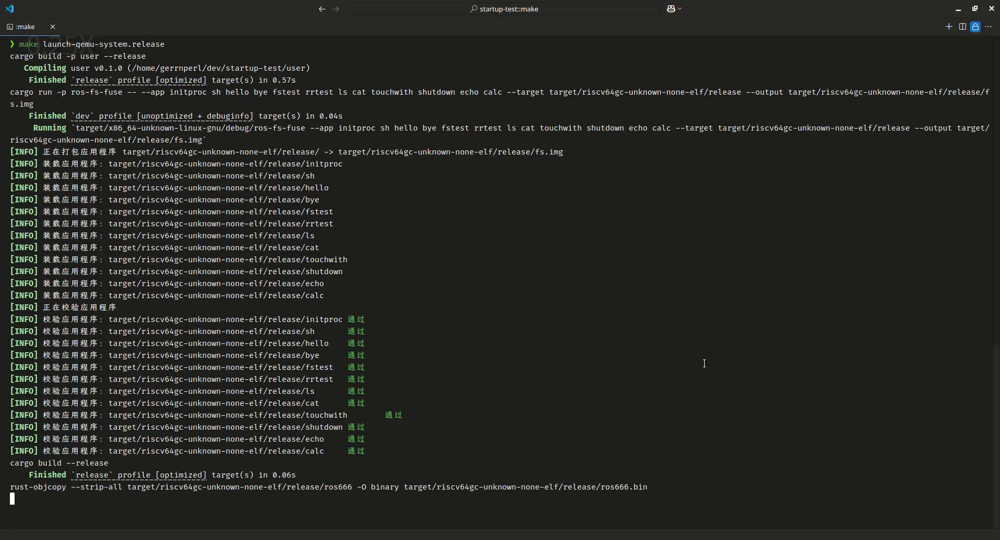
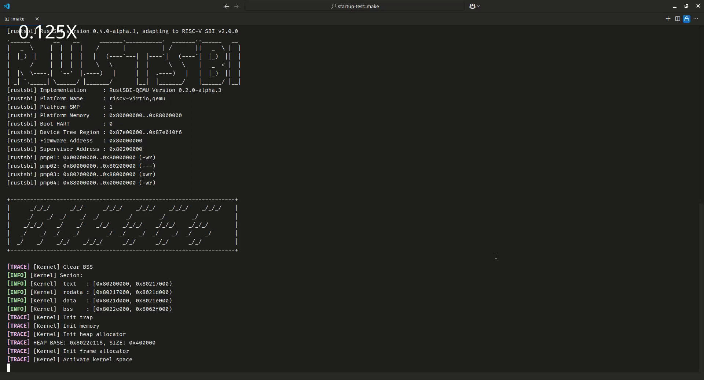
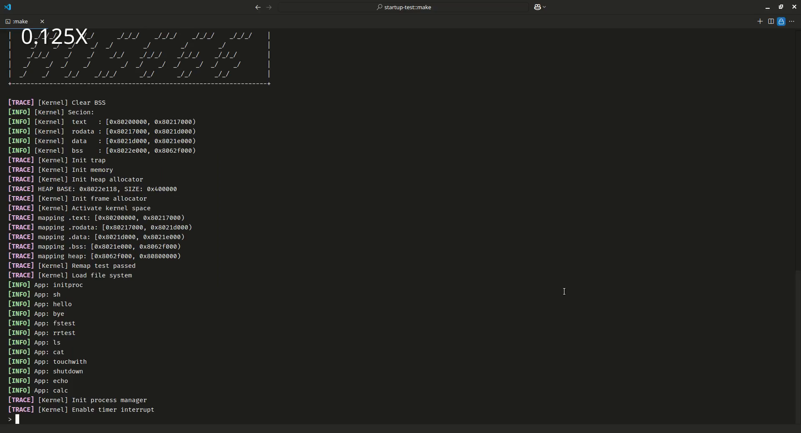
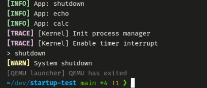
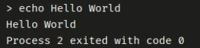
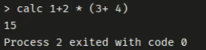
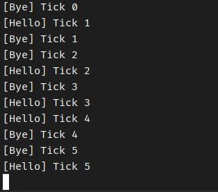
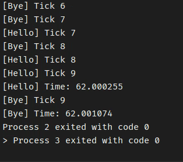
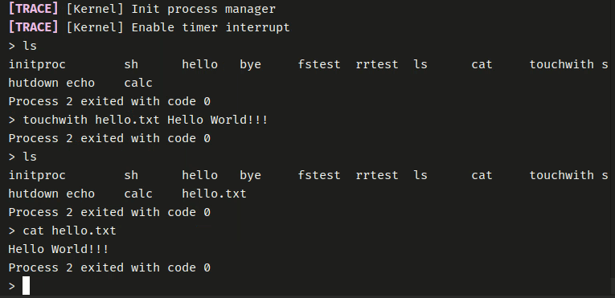

# 功能测试

本文档将在用户程序层面综合测试内核的功能。

主要从内核启动和关闭、用户态程序和命令行参数解析、进程调度、文件系统等方面进行测试，展示内核的功能。

## 1. 内核启动和关闭

使用 `make launch-qemu-system.release` 启动内核。

首先编译用户程序和内核，并打包成镜像文件。

启动 QEMU, 加载 Rust SBI Boot Loader 和内核。

内核启动成功，显示内核信息。

在内核启动时，会初始化内核存储管理、陷入处理、时钟、进程管理等，从内核启动信息可以看到内核初始化的过程。

使用 `shutdown` 命令关闭内核。或者使用 `Ctrl+A X` 退出 QEMU。

## 2. 用户态程序和命令行参数解析

系统启动之后，会自动运行 `initproc` 和 `sh` 程序。

在 `sh` 程序中，可以执行用户程序，并传递参数。

运行 `echo Hello World` 命令。

运行 `calc` 程序，计算 `1 + 2 * (3 + 4)`。

## 3. 进程调度

内核支持基于时间片轮转的进程调度。

运行 `rrtest` 程序，测试进程调度。

其会并发执行 `hello` 和 `bye` 程序。

可以看到，`hello` 和 `bye` 程序可以并发执行，并且存在不可预测的交替执行情况。

## 4. 文件系统

可以使用 `ls` 命令查看文件系统中的文件。

使用 `touchwith` 创建文件，并向文件中写入内容。

使用 `cat` 查看文件内容。

这里将 `Hello World!!!` 写入 `hello.txt` 文件。

然后使用 `cat` 查看文件内容。

可以看到，文件被成功创建，并且内容被成功写入。并且可以通过 `cat` 命令查看文件内容。
