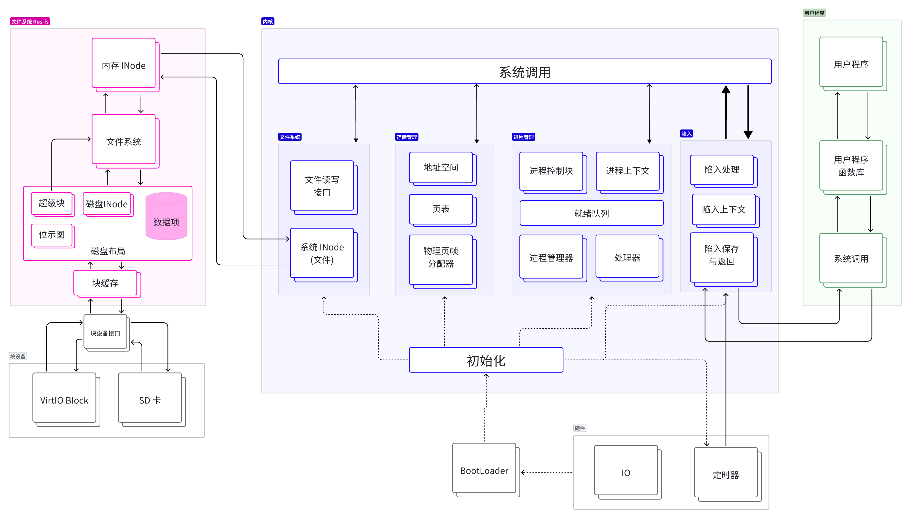

## ROS666 概述

```
    _/_/_/      _/_/      _/_/_/    _/_/_/    _/_/_/    _/_/_/ 
   _/    _/  _/    _/  _/        _/        _/        _/        
  _/_/_/    _/    _/    _/_/    _/_/_/    _/_/_/    _/_/_/     
 _/    _/  _/    _/        _/  _/    _/  _/    _/  _/    _/    
_/    _/    _/_/    _/_/_/      _/_/      _/_/      _/_/       
```

- [ROS666 概述](#ros666-概述)
  - [项目概述](#项目概述)
  - [本项目的意义与价值](#本项目的意义与价值)
  - [创新点](#创新点)
  - [整体架构](#整体架构)
  - [小组在项目中的收获](#小组在项目中的收获)


### 项目概述

本项目是合肥工业大学 HFUT666 团队为 [2024年全国大学生计算机系统能力大赛-操作系统设计赛(华东区域赛)-OS原理赛道](https://os.educg.net/?token=mFdHhJEk3gYJUVY04cNJCPrCl4h4Nxeu4EEkp6Vszn#/index?TYPE=OS_HDN/#/index?TYPE=OS_HDN) 比赛开发的项目。
该项目从零开始，使用 Rust 编程语言，在 RISC-V 架构上实现了一个简单的类 Unix 操作系统内核。

项目团队成员包括：
- 万立志 @MagicalMagic | [GitHub](https://github.com/MagicBeards) | [gitlab.eduxiji.net](https://gitlab.eduxiji.net/MagicalMagic)
- 高培骏 @FengSheng0804 | [GitHub](https://github.com/FengSheng0804) | [gitlab.eduxiji.net](https://gitlab.eduxiji.net/FengSheng0804)
- 卢继鹏 @Gerrnperl | [GitHub](https://github.com/Gerrnperl/) | [gitlab.eduxiji.net](https://gitlab.eduxiji.net/gerrnperl)。

项目主要参考了 [rCore-Tutorial-Book-v3](https://rcore-os.cn/rCore-Tutorial-Book-v3/) 教程; 
块设备驱动、部分测试代码以及部分内核实现参考了[rCore-Tutorial-v3](https://github.com/rcore-os/rCore-Tutorial-v3)、[slab_allocator - Slab allocator for no_std systems. ](https://github.com/weclaw1/slab_allocator/tree/master) 和 [virtio-drivers](https://github.com/rcore-os/virtio-drivers) 等开源项目的代码; 
项目的实现也离不开 [Rust 语言](https://www.rust-lang.org/) 及其[生态](https://crates.io/)、[rCore OS 社区](https://github.com/rcore-os) 生态的支持。
**在此，我们对这些开源项目和社区表示感谢**。

OSKernel2024-ROS666项目实现了操作系统的核心功能，
包括裸机内核启动、标准输入输出、陷入与陷入返回机制、动态内存分配（使用Slab Allocator）、分页机制、时钟中断、进程管理与调度、文件系统支持、用户态程序执行以及系统调用等。

在这些内核功能之上，项目完成了 stdio 和文件系统的读写、打开、关闭操作，以及进程的分叉（clone/fork）、执行（execve）、等待（wait）、退出（exit）、让权休眠（sched_yield）等进程管理功能，
并实现了获取时间（gettime）和系统关闭（shutdown）等系统调用。

在开发过程中，团队共进行了260余次提交，累计编写了约8500行代码。
项目通过多个版本的迭代，逐步完成了从基本的裸机程序 Hello World 到完善的进程管理、文件系统支持以及用户程序执行等核心任务。

OSKernel2024-ROS666项目不仅是一次技术挑战和实践机会，也是团队成员在操作系统原理、Rust编程以及团队协作等方面的一次全面提升。
通过参与这个项目，团队成员深入理解了操作系统的内部机制和工作原理，积累了宝贵的开发经验和知识。

我们深知项目仍有许多不足之处，离一个 *比较完整的操作系统内核* 还有很大的差距，
但我们也为项目的成果感到自豪。
在未来，我们将继续完善项目，提高代码质量，增加更多功能，以期更好地服务于教育和技术交流。

### 本项目的意义与价值

操作系统是计算机系统中最重要的基础软件之一，是连接硬件与软件的桥梁。
它不仅决定了计算机资源的管理效率，还直接影响系统的安全性、稳定性与用户体验。

在计算机教育中，操作系统课程具有举足轻重的地位，如何通过实践帮助学生理解复杂的内核机制、从理论到实现掌握系统设计的精髓，是教学中的一大挑战。

本项目以Rust 编程语言为基础，采用模块化设计和精细化实现，开发了一个小型内核系统。

通过实现裸机启动、动态内存分配、分页机制、进程管理与调度、文件系统、用户态程序及系统调用等核心模块，
我们为教学和研究提供了一个兼具现代性与安全性的操作系统内核项目。

我们的项目在操作系统教学中的所能起到的帮助：

1. 弥合理论与实践的鸿沟
   
    操作系统课程中涉及的知识点繁多，包括内存管理、进程调度、系统调用等等，学生在课堂上学习这些理论时常感到抽象和难以理解。
    
    而本项目通过从零开发一个小型内核，提供了完整的代码实现与模块化设计，让学生能够通过动手实践，直观感受到操作系统各模块如何协同工作，从而加深对理论的理解。

    例如，学生可以在代码中观察分页机制如何实现虚拟内存到物理内存的映射，或者亲自调试进程调度算法，了解时间片轮转的实际效果。
    
    这种从理论到代码再到实际运行的完整学习路径，极大地提升了教学的效果。

2. 覆盖核心模块，完整展现操作系统的设计思想

    本项目已经实现了从裸机内核启动到系统调用的全链路功能，覆盖了操作系统中最核心的模块：
    1. 裸机启动：帮助学生了解从硬件启动到操作系统加载的过程；
    2. 动态内存分配：通过Slab Allocator实现高效内存管理，展示内存分配器的核心思想；
    3. 分页机制：实现虚拟内存管理，帮助学生理解内存隔离与权限控制的重要性；
    4. 进程管理与调度：通过时间片轮转与进程状态切换，完整展现任务调度的核心逻辑；
    5. 文件系统与系统调用：为用户态程序提供标准输入输出、文件操作及进程控制等系统接口，展现操作系统对上层应用的支持。

    这些功能的实现不仅涵盖了操作系统课程的核心内容，还为学生提供了一个可运行的内核系统，真正做到理论与实践的深度融合。

3. 提升编程能力与系统思维

    在操作系统教学中，学生经常面临如何设计复杂系统的问题。
    通过本项目，学生能够学习到模块化设计的思想，每个模块（如内存管理、进程调度等）既独立又协作，便于理解和维护。
    此外，学生还可以学习到如何使用现代化工具链（如Rust编译器和裸机开发工具）进行系统级开发，
    这种实践能力对于未来从事嵌入式系统开发、操作系统研究或高性能计算开发具有重要意义。

为什么选用 Rust 语言?

在本项目中，我们选择 Rust 作为开发语言，主要基于其独特的优势，特别是面向系统安全性和开发效率的突出特性。

操作系统的核心模块（如动态内存分配、进程调度等）需要对内存进行频繁的管理与操作。
传统的 C 语言虽然高效，但容易因为指针错误、空指针访问或数据竞争导致系统崩溃甚至安全漏洞。
而 Rust 的所有权机制、借用检查和编译时内存安全性保障，可以从根本上杜绝这类问题。
例如，在实现动态内存分配（Slab Allocator）时，Rust 的借用检查器确保了多线程场景下不会发生内存访问冲突，提高了内存分配器的安全性与鲁棒性。

此外 Rust 提供了与 C/C++ 相当的性能，同时通过零开销抽象，使得复杂数据结构的实现既高效又易于维护。
在本项目中，我们在实现分页机制和进程调度时充分利用了 Rust 的高性能特性，例如通过枚举和模式匹配高效处理进程状态切换。

Rust还有拥有成熟的裸机开发生态（如 core 库、alloc 库）和完善的工具链支持（如 cargo 构建系统），这使得开发裸机内核的过程更加高效。

此外 Rust 提供了明确的模块化体系结构，通过 crate 和模块的组合，可以轻松实现内核的模块化设计。
我们在项目中将内核功能划分为多个模块（如内核、用户程序库、用户程序、文件系统、堆内存分配器等），提高了代码的可读性和可维护性，还方便了针对单一模块进行学习与调试。

值得一提的是，这种模块化设计也为后续扩展内核功能提供了良好的基础。

最后本项目通过基于 Rust 的小型内核开发，探索了如何以现代化、安全、高效的方式实现操作系统核心模块。
这不仅为操作系统教学提供了新思路，也为未来其他同学们在此项目基础上进行创新研究提供了一个完善的平台。
我们相信该项目经过后续我们自身以及其他同学们的不断完善和扩展，项目将在推动操作系统教学发展以及小型内核实现和创新的道路上继续发挥更大的作用。

### 创新点

- **基于 Rust 语言的现代化内核设计**

    本项目完全使用 Rust 语言开发，充分利用 Rust 的内存安全性、高性能和模块化设计特性，实现了一个现代化的小型内核。
    Rust 的所有权机制、借用检查和编译时内存安全性保障，有效避免了内存错误和数据竞争问题，提高了内核的安全性和稳定性。
    通过 Rust 的模块化设计和 crate 生态，我们实现了内核的模块化设计，提高了代码的可读性和可维护性。

- **Slab Allocator 动态内存分配器**

    本项目实现了一个高效的 Slab Allocator 动态内存分配器，用于管理内核的动态内存分配。
    Slab Allocator 通过预先分配一定数量的固定大小的内存块，然后根据需要将内存块分配给请求者，在减少内存内碎片的同时，提高了内存分配的效率。

    通过 Slab Allocator，我们实现了内核的动态内存分配功能，为内核的进程管理和文件系统提供了基础支持。

- **用户程序与函数库和构建流分离**
    
    本项目将用户程序与函数库和构建流分离，用户程序通过独立的函数库调用系统调用，实现了用户程序与内核的分离。函数库已实现的函数遵循 gcc 和 Linux 程序库的结构，系统调用也遵循 Linux 系统调用的规范，使得用户程序的编写更加方便。

    用户程序构建依赖用于在用户程序构建时，指定链接脚本、编译选项等。用户程序可以以此为构建依赖，在`build.rs`构建脚本中调用此库提供的函数，配置用户程序的构建。如此可以分离用户程序构建依赖，使得用户程序构建更加简洁，并提高用户程序的独立性。

- **系统调用接口模块**

    内核和用户程序间的系统调用使用枚举进行封装，并定义在独立的模块中，实现了系统调用的统一管理和调用，避免了系统调用重复定义和混乱的问题。

- **非阻塞 Rust SBI IO的阻塞式封装**

    Rust SBI IO 接口是一个非阻塞的 IO 接口，在 IO 缓冲无数据时会立即返回，这对于内核的 IO 操作是不方便的。

    本项目实现了非阻塞 Rust SBI IO的阻塞式封装，通过封装 Rust SBI IO 接口，实现了对 Rust SBI IO 的阻塞式调用，使得内核的 IO 操作更加方便。对于用户程序，阻塞是让权的，在等待时，用户程序会让出 CPU，等待 IO 完成后再继续执行。

- **充分利用 RAII 机制实现资源管理**

    本项目充分利用 Rust 的 RAII 机制，通过实现 Drop trait，实现了对资源的自动释放和管理，避免了资源泄漏和内存泄漏的问题。

- **完善的构建与调试配置**

    项目提供了完善的构建与调试配置，包括 Makefile 构建脚本，并且充分结合 VSCode 提供的任务及调试配置，覆盖了从环境检查、编译、打包、运行到调试的全流程，使得开发调试更加方便。

### 整体架构



系统主要模块包括公共模块、文件系统模块、文件系统镜像打包工具、动态内存分配器、内核源码、用户程序、用户程序函数库和用户程序构建依赖。

```
.
├── .cargo                      # Cargo 配置
│  └── config.toml
├── .github                     # GitHub Actions 配置
│  └── workflows
│     └── cargo-doc.yml         # 项目 cargo doc 代码文档的持续集成配置
├── .vscode                     # VSCode 配置
│  ├── extensions.json          # VSCode 集成调试所需的插件
│  ├── launch.json              # 调试配置
│  ├── settings.json            # VSCode 设置
│  └── tasks.json               # 任务配置
├── bootloader                  # RustSBI 启动引导程序
│  └── rustsbi-qemu-release
├── build.rs                    # 内核构建脚本
├── common                      # 适用于内核和用户程序的公共模块，如系统调用接口
│  ├── Cargo.toml
│  ├── README.md
│  └── src
│     ├── lib.rs
│     └── syscall.rs
├── docs                        # 项目文档
│  └── ...
├── LICENSE                     # 开源许可证 (GPL-3.0)
├── Makefile                    # 项目构建 Makefile 脚本
├── README.md
├── ros-fs                      # 文件系统模块
│  ├── Cargo.toml
│  ├── README.md
│  └── src
│     ├── bitmap.rs             # 位示图管理
│     ├── block_cache.rs        # 块缓存管理
│     ├── block_dev.rs          # 块设备接口
│     ├── fs.rs                 # 文件系统抽象层
│     ├── layout                # 磁盘布局层
│     │  ├── dir_entry.rs       # 磁盘布局/目录项
│     │  ├── disk_inode.rs      # 磁盘布局/索引节点
│     │  ├── mod.rs             # 磁盘布局模块入口
│     │  └── super_block.rs     # 磁盘布局/超级块
│     ├── lib.rs                # 文件系统模块入口
│     └── virt_fs.rs            # 文件和目录操作（内存 Inode 部分）
├── ros-fs-fuse                 # 文件系统镜像打包工具
│  ├── Cargo.toml
│  ├── README.md
│  └── src
│     ├── block_file.rs
│     └── main.rs
├── scripts                     # 项目脚本
│  └── check-dev-requirements.sh# 检查开发环境脚本
├── slab_allocator              # Slab Allocator 动态内存分配器
│  ├── Cargo.toml
│  ├── README.md
│  └── src
│     ├── lib.rs                # Slab Allocator 模块入口及堆内存分配器实现
│     └── slab.rs               # Slab Allocator 实现
├── src                         # 内核源码
│  ├── drivers                  # 设备驱动
│  │  ├── block                 # 块设备驱动
│  │  │  ├── mod.rs             # 块设备驱动模块入口
│  │  │  ├── sdcard.rs          # SD 卡驱动
│  │  │  └── virtio_block.rs    # VirtIO 块设备驱动
│  │  └── mod.rs                # 设备驱动模块入口
│  ├── entry.asm                # 内核入口汇编代码
│  ├── fs                       # 文件系统 (文件和目录操作，系统 Inode 部分)
│  │  ├── inode.rs              # 系统 Inode，提供读写接口
│  │  ├── mod.rs                # 文件系统模块入口
│  │  └── stdio.rs              # 基于文件描述符的标准输入输出
│  ├── io                       # 输入输出
│  │  ├── log.rs                # 日志输出
│  │  ├── mod.rs                # 输入输出模块入口
│  │  └── stdio.rs              # SBI 标准输入输出 (Console 相关IO)
│  ├── language_item.rs         # Rust 语言项
│  ├── linker.ld                # 内核链接脚本
│  ├── main.rs                  # 内核入口及初始化
│  ├── mm                       # 内存管理
│  │  ├── address.rs            # 地址抽象
│  │  ├── frame_allocator.rs    # 物理页帧分配器
│  │  ├── heap_allocator.rs     # 堆内存分配器 (Slab Allocator 实例)
│  │  ├── init.rs               # 内存管理初始化
│  │  ├── memory_set.rs         # 逻辑段和地址空间
│  │  ├── mod.rs                # 内存管理模块入口  
│  │  └── page_table.rs         # 页表管理
│  ├── sbi.rs                   # RustSBI 接口封装
│  ├── syscall.rs               # 系统调用接口实现
│  ├── task                     # 进程管理
│  │  ├── context.rs            # 进程上下文
│  │  ├── manager.rs            # 进程管理器    
│  │  ├── mod.rs                # 进程管理模块入口
│  │  ├── pid.rs                # 进程 PID 分配回收管理
│  │  ├── processor.rs          # 进程处理器
│  │  ├── stack.rs              # 进程内核栈
│  │  ├── switch.asm            # 进程切换汇编代码
│  │  ├── switch.rs             # 进程切换实现
│  │  └── task.rs               # 进程控制块
│  ├── timer.rs                 # 时钟中断相关
│  ├── trap                     # 陷入与陷入返回
│  │  ├── context.rs            # 陷入上下文
│  │  ├── handler.rs            # 陷入处理
│  │  ├── init.rs               # 陷入初始化
│  │  ├── mod.rs                # 陷入模块入口
│  │  └── trap.asm              # 陷入与陷入返回汇编代码
│  └── utils                    # 工具模块
│     ├── macros.rs             # 宏定义，包括用于引用外部定义符号的宏
│     ├── mod.rs                # 工具模块入口
│     └── safety.rs             # 安全性封装相关
├── user                        # 用户程序
│  ├── build.rs                 # 用户程序构建脚本 (导入 user-build 执行)
│  ├── Cargo.toml
│  ├── README.md
│  └── src                      # 用户程序源码
│     ├── bye/bin/main.rs       # bye，测试输出、时间获取、协作式调度
│     ├── calc/bin/main.rs      # calc，简单的四则运算计算器
│     ├── cat/bin/main.rs       # cat，读取文件
│     ├── echo/bin/main.rs      # echo，测试标准输入输出和命令行参数解析
│     ├── fstest/bin/main.rs    # fstest，测试文件系统读写
│     ├── hello/bin/main.rs     # hello，和 bye 一致
│     ├── initproc/bin/main.rs  # initproc，系统第一个用户进程，主要是打开 shell
│     ├── ls/bin/main.rs        # ls，文件系统目录读取
│     ├── rrtest/bin/main.rs    # rrtest，测试时间片轮转进程调度，并发执行 hello 和 bye
│     ├── sh/bin/main.rs        # sh，简单的 shell，参数解析和程序执行
│     ├── shutdown/bin/main.rs  # shutdown，关机
│     └── touchwith/bin/main.rs # touchwith，创建文件，并写入内容
├── user-build                  # 用户程序构建流依赖
│  ├── Cargo.toml
│  ├── README.md
│  └── src
│     ├── lib.rs                # 用户程序构建流依赖模块入口
│     └── linker.template.ld    # 用户程序链接脚本模板
└── user-lib                    # 用户程序函数库
   ├── Cargo.toml
   ├── README.md
   └── src                      # 用户程序函数库源码
      ├── fcntl.rs              # 文件控制
      ├── heap_allocator.rs     # 用户程序堆内存分配器 (Slab Allocator 实例)
      ├── language_item.rs      # Rust 语言项
      ├── lib.rs                # 用户程序函数库模块入口
      ├── sched.rs              # 调度相关
      ├── stdio.rs              # 标准输入输出
      ├── sys                   # 系统相关
      │  ├── mod.rs
      │  ├── time.rs            # 时间获取
      │  └── wait.rs            # 进程等待
      ├── syscall.rs            # 系统调用，访管指令封装
      └── unistd.rs             # 定义在 POSIX 标准中并且实现了的系统调用封装
```

### 小组在项目中的收获

我们项目组的三个成员通过开发本项目，每个人收获到了很多，包括技术能力的提升、对操作系统的深入理解、成就感与职业自信心的提升等。

首先就是技术能力的全面提升。

通过本项目，我们从零开始构建了一个小型操作系统内核，深刻理解了操作系统的核心原理，
并掌握了如何将复杂的理论知识转化为实际代码。

项目中全面使用Rust语言开发，这不仅让我们熟悉了Rust的语法和特性，也让我们对使用Rust语法开发其他项目有了更大的信心。

其次就是对操作系统的理解更加深入。

我们共同完成了从裸机启动到用户态程序运行的全链路开发，全面掌握了操作系统从硬件到软件的关键交互机制。

通过本项目，我们不仅理解了操作系统的基本原理，也深刻认识到其在计算机体系结构中的核心地位。

无论是Slab分配器的实现、分页机制的映射逻辑，还是进程调度的状态切换，我们都深入研究了实现细节并不断优化。因此动手实践搭配上课堂的学习让我们对操作系统各个模块的认识不断加深。

最后是成就感与职业自信心的提升。

从最初的构想到完整内核系统的实现，我们经历了从零到一的创造过程。
这种从无到有的开发经历让我们获得了极大的成就感，同时也增强了我们在系统开发领域的自信心。

在内核开发过程中经常会遇到各种问题，有一些问题甚至是几近于无法调试的，
在实现进程切换时错误的上下文和切换返回地址;
在实现分页机制时错误的页表映射和非法的内存访问;
在实现文件系统时非法的 DMA 映射和错误的驱动程序实现等等。

每一个 Bug 似乎都是不可逾越的障碍，在 GDB 也无法有效调试的情况下，这些问题曾让我们感到无比的挫败。然而，在不断的尝试和调试中，我们最终找到了解决问题的方法，这种突破困难的经历让我们更加坚信自己的能力。

我们每个人相信，这次合作开发的经历将成为未来职业发展的重要基石，无论是在操作系统领域的进一步研究，还是在实际工程项目中，我们都将更加游刃有余。

未来，我们还将继续在此项目基础上不断优化已有的模块同时去实现其他还没有实现的功能。我们不会因为比赛的结束而结束我们项目的开发，我们的目标永远是实现一个更加完善、更加完美的小型内核。