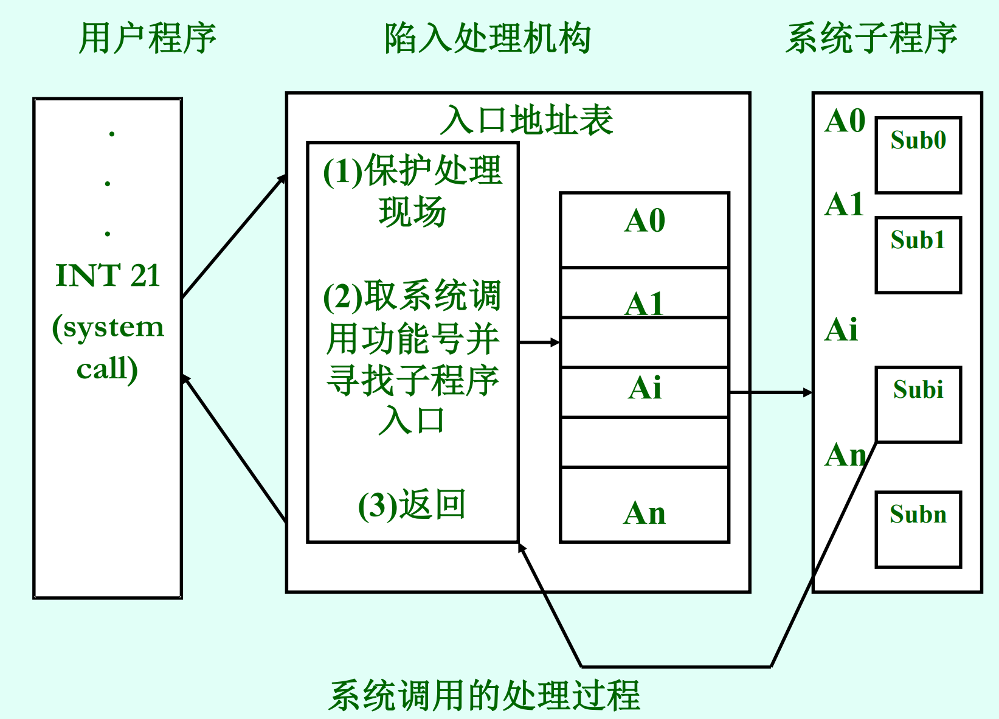
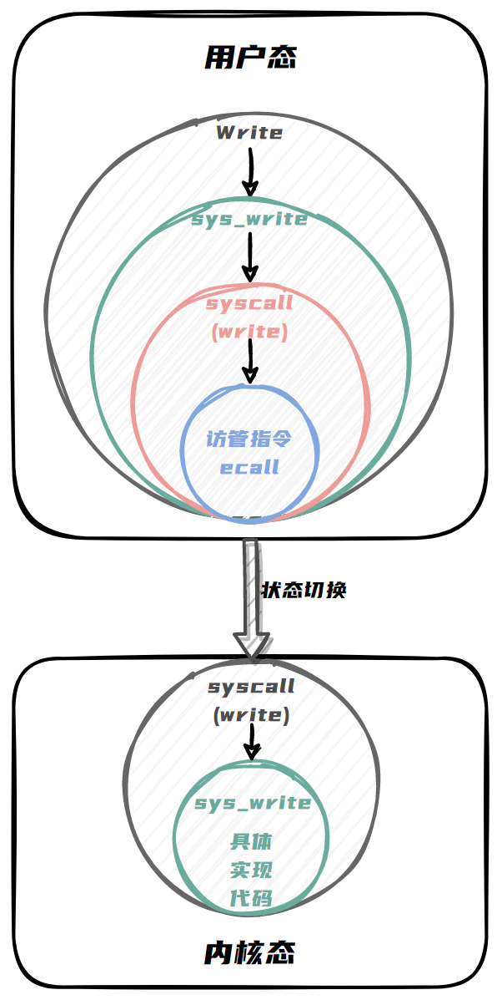

# 系统调用

- [系统调用](#系统调用)
  - [系统调用的原理](#系统调用的原理)
    - [用户态与内核态的隔离](#用户态与内核态的隔离)
    - [系统调用与函数调用的区别](#系统调用与函数调用的区别)
    - [系统调用的触发机制](#系统调用的触发机制)
    - [系统调用处理流程](#系统调用处理流程)
    - [内核态到用户态的返回机制](#内核态到用户态的返回机制)
    - [系统调用的安全性和可靠性保障](#系统调用的安全性和可靠性保障)
  - [系统调用的过程](#系统调用的过程)
  - [系统调用的实现](#系统调用的实现)
    - [系统调用号定义与分配](#系统调用号定义与分配)
    - [系统调用接口函数实现](#系统调用接口函数实现)
      - [sys\_openat：](#sys_openat)
      - [sys\_close](#sys_close)
      - [sys\_read](#sys_read)
      - [sys\_write](#sys_write)
      - [sys\_exit](#sys_exit)
      - [sys\_yield](#sys_yield)
      - [sys\_get\_time\_of\_day](#sys_get_time_of_day)
      - [sys\_shutdown](#sys_shutdown)
      - [sys\_clone](#sys_clone)
      - [sys\_execve](#sys_execve)
      - [sys\_wait4](#sys_wait4)
  - [系统调用的封装](#系统调用的封装)

## 系统调用的原理

用户在程序中调用操作系统所提供的一些子功能。通常也把被调用的操作系统功能，称为系统调用。

### 用户态与内核态的隔离

操作系统为了保证系统的安全性和稳定性，将处理器的执行模式分为用户态和内核态。用户程序在用户态下运行，受到诸多限制，例如不能直接访问硬件设备、不能随意修改系统关键数据结构等。而内核态则拥有最高权限，可以执行诸如设备驱动、内存管理、进程调度等关键操作。

这种隔离机制是基于处理器的硬件支持实现的。在 CPU 的特权级机制下，不同的指令在不同的特权级下有不同的执行权限。某些特权指令只能在内核态下执行。

### 系统调用与函数调用的区别

1. **进入和退出方式不同**

   **系统调用：**INT/IRET

   **函数调用：** CALL/RET

2. **CPU状态变化不同**

   **系统调用：**用户态 → 系统态 → 用户态

   **函数调用：**无CPU状态变化

### 系统调用的触发机制

- **指令陷入**：

  当用户程序需要执行内核提供的服务时，通过执行一条特殊的陷入指令来发起系统调用。这条指令会导致处理器从用户态切换到内核态，并将执行流程转移到预先定义好的内核入口点。

- **参数传递**：

  在触发系统调用之前，用户程序需要将系统调用号和相关参数传递给内核。在RISC - V架构中，系统调用号存放在寄存器a7，而系统调用的参数则存放在寄存器a0 - a6中。

### 系统调用处理流程

- **中断向量表与入口点**：

  当陷入指令执行后，处理器会根据中断向量表来确定系统调用的内核入口点。这个入口点通常是一个通用的系统调用处理程序或分发器。

- **系统调用分发器**：

  内核中的系统调用分发器会首先获取系统调用号，然后根据这个号码来调用相应的具体系统调用处理函数。这个分发器就像是一个调度中心，它根据用户程序的请求将执行流程引导到正确的内核服务模块。

- **具体系统调用处理函数**：

  每个具体的系统调用处理函数实现了特定的内核服务。以文件读写系统调用为例，文件读写处理函数会与文件系统模块交互，执行诸如查找文件、验证权限、读写磁盘数据等操作。这些处理函数可以访问内核的数据结构和硬件资源，因为它们是在内核态下执行的。

### 内核态到用户态的返回机制

在系统调用处理函数完成服务后，它需要将执行流程从内核态切换回用户态，以便用户程序能够继续执行。这个返回过程通常涉及恢复用户程序在触发系统调用时保存的上下文信息，包括寄存器状态、程序计数器等。

内核会将系统调用的返回值存放在寄存器a0中，然后通过执行`sret`来切换回用户态。用户程序在返回后可以从这个寄存器中获取系统调用的返回值，并根据返回值继续执行后续操作。

### 系统调用的安全性和可靠性保障

- **参数验证**：

  内核在处理系统调用时，会对用户程序传递的参数进行验证。例如，对于文件操作的系统调用，内核会检查文件路径是否合法、读写权限是否符合要求等。这样可以防止用户程序通过恶意参数来破坏系统的稳定性或访问未经授权的资源。

- **上下文保存与恢复**：

  系统调用过程中准确地保存和恢复用户程序的上下文是保证系统调用可靠性的关键。如果上下文恢复出现错误，可能会导致用户程序执行异常或崩溃。因此，操作系统会使用专门的数据结构来安全地保存和恢复这些信息。

## 系统调用的过程

1. **用户程序发起调用**
   - **参数准备**：当用户程序需要使用操作系统提供的某种服务时，如文件读写、进程创建等，首先会在用户空间准备好系统调用所需的参数。
   - **系统调用号指定**：每个系统调用都有一个对应的系统调用号。用户程序需要以某种方式指定要执行的系统调用号，这个号码用于在内核中识别具体的系统调用。
   - **触发调用指令执行**：在参数准备好和系统调用号确定后，用户程序通过执行一条特殊的指令来触发系统调用。在我们的操作系统中，使用的是 RISC - V 架构中的 “ecall” 指令，这条指令会导致处理器从用户态切换到内核态，开启系统调用的处理流程。
2. **陷入内核态及参数传递**
   - **陷入机制**：当触发系统调用的指令执行后，处理器会根据硬件的中断机制进入内核态。这个过程类似于硬件中断，但系统调用是一种软件触发的、有目的的陷入。在进入内核态时，处理器会保存当前用户程序的一些关键上下文信息，如程序计数器（PC）、寄存器状态等，以便在系统调用返回后能够恢复用户程序的执行。
   - **参数传递方式**：我们通过将系统调用号存放在指定的寄存器中来实现对系统调用的参数传递。其中a0-a2 存放参数，a7存放系统调用号，a0存放返回值。这样，内核可以从这些寄存器中获取系统调用号和参数信息。
3. **内核中的系统调用分发与处理**
   - **系统调用分发器**：内核中有一个系统调用分发器，它是系统调用处理的入口点。分发器首先会从相应的寄存器中获取系统调用号。然后，根据这个系统调用号，通过一个类似于 “match”的机制，将执行流程引导到具体的系统调用处理函数。
   - **具体系统调用处理函数**：每个系统调用号对应一个具体的处理函数，这些函数实现了特定的内核服务。我们实现的系统调用函数包括：sys_openat、sys_close、sys_read、sys_write、sys_exit、sys_yield、sys_get_time_of_day、sys_shutdown、sys_clone、sys_execve、sys_wait4。这些处理函数可以访问和操作内核的数据结构和硬件资源，因为它们是在内核态下执行的。
4. **内核态到用户态的返回**
   - **返回值设置**：在系统调用处理函数完成其任务后，会将返回值放置在寄存器a0中。这个返回值可以是系统调用的执行结果，如文件打开系统调用返回的文件描述符，或者是错误码，表示系统调用执行过程中出现的问题。
   - **恢复用户程序上下文**：内核会从之前保存的用户程序上下文信息中恢复寄存器状态、程序计数器等内容，然后通过执行“sret” 指令将处理器的执行模式从内核态切换回用户态。这样，用户程序就可以从系统调用指令的下一条指令开始继续执行，并从寄存器a0中获取系统调用的返回值。

<div style="text-align:center;">
    
</div>


## 系统调用的实现

### 系统调用号定义与分配

我们使用枚举类型来定义为每个系统调用分配一个唯一的编号。

```rust
#[derive(Debug, Clone, Copy)]
pub enum Syscall {
    OpenAt = 56,        // 打开文件
    Close = 57,         // 关闭文件
    Read = 63,          // 从文件描述符读取
    Write = 64,         // 写入文件描述符
    Exit = 93,          // 终止当前进程
    SchedYield = 124,   // 让出处理器
    GetTimeOfDay = 169, // 读取当前时间
    Shutdown = 210,     // 关机 (shutdown)
    Clone = 220,        // 创建子进程 (fork)
    Execve = 221,       // 执行程序 (exec)
    Wait4 = 260,        // 等待子进程 (waitpid)
}
```

这样在用户程序发起系统调用时，通过传递这个编号，内核就能确定具体要执行的系统调用服务。

### 系统调用接口函数实现

在用户空间提供一组与系统调用对应的函数声明，这些函数会进行一些参数检查和预处理工作，然后通过RISC-V 架构中的`ecall`指令触发系统调用陷入内核。

| 系统调用函数名      | 参数说明                                                                                                 | 参数类型                                               |
| ------------------- | -------------------------------------------------------------------------------------------------------- | ------------------------------------------------------ |
| sys_close           | `fd`：文件描述符                                                                                         | `fd`：`usize`类型                                      |
| sys_openat          | `path`：文件路径<br/>`flags`：打开文件相关标志                                                           | `path`：`&str`类型<br />`flags`：`usize`类型           |
| sys_read            | `fd`：文件描述符<br/>`buffer`：用于存储读取数据的缓冲区                                                  | `fd`：`usize`类型<br />`buffer`：`&mut [u8]`类型       |
| sys_write           | `fd`：文件描述符<br/>`buffer`：要写入的数据                                                              | `fd`：`usize`类型<br />`buffer`：`&mut [u8]`类型       |
| sys_exit            | `code`：退出码                                                                                           | `code`：`usize`类型                                    |
| sys_sched_yield     | 无                                                                                                       | 无                                                     |
| sys_get_time_of_day | `ts`：指向`TimeVal`结构体的指针，用于存储当前时间<br/>`tz`：指向`TimeZone`结构体的指针，用于存储时区信息 | `ts`：`*mut TimeVal`类型<br/>`tz`：`*mut TimeZone`类型 |
| sys_shutdown        | 无                                                                                                       | 无                                                     |
| sys_clone           | 无                                                                                                       | 无                                                     |
| sys_execve          | `path`：程序路径                                                                                         | `path`：`&str`类型                                     |
| sys_wait4           | `pid`：子进程的进程 ID<br/>`exit_code`：指向`i32`类型的指针，用于存储子进程的退出码                      | `pid`：`isize`类型<br />`exit_code`：`*mut i32`类型    |


#### sys_openat：

`sys_openat`函数主要用于实现打开文件相关的系统调用功能。

首先，为了后续能基于当前处理器所处的进程环境来进行相应操作，我们使用`Processor::get_current().unwrap()`获取当前的处理器相关信息。接着，调用`get_translated_string`函数对传入的文件路径进行处理，在此过程中，利用`Processor::current_user_token().unwrap()`获取当前用户的相关令牌，并将原始的文件路径指针`path`传入，得到可识别的字符串形式的路径，方便后续操作。然后，调用`open_file`函数并传入转换后的文件路径字符串以及由`OpenFlags::from_bits(flags).unwrap()`解析出的打开文件标志，尝试打开文件，若成功打开则会得到对应的文件`inode`信息。如果成功获取到了`inode`，那么就通过当前处理器对应的可修改状态来分配一个文件描述符，即调用`alloc_fd`方法获取可用的文件描述符编号`fd`，随后将获取到的`inode`存放到当前处理器对应进程的文件描述符表中，最后将该文件描述符编号`fd`转换为`SyscallRet`类型作为函数的返回值，表示文件成功打开并返回对应的文件描述符；而如果`open_file`函数未能成功打开文件，也就是没有获取到相应的`inode`，此时函数则直接返回`-1`，以此来告知调用者文件打开操作失败。

```rust
pub fn sys_openat(path: *const u8, flags: usize) -> SyscallRet {
    let current = Processor::get_current().unwrap();
    let path = get_translated_string(Processor::current_user_token().unwrap(), path as *const u8);
    let inode = open_file(path.as_str(), OpenFlags::from_bits(flags).unwrap());
    if let Some(inode) = inode {
        let fd = current.inner_borrow_mut().alloc_fd();
        current.inner_borrow_mut().fd_table[fd] = Some(inode);
        fd as SyscallRet
    } else {
        -1
    }
}
```

#### sys_close

`sys_close`函数的功能主要是实现关闭文件描述符对应的文件这一系统调用操作。

首先，函数通过`Processor::get_current().unwrap()`获取当前处理器相关的信息，然后，再利用`current.inner_borrow_mut()`以可变借用的方式得到对应的进程控制块（`pcb`），这是因为后续要对进程控制块里的文件描述符表进行操作，所以需要可变访问权限。接着，会进行两项检查，一是判断传入的文件描述符`fd`是否超出了当前进程控制块中文件描述符表的长度范围，如果`fd`大于等于`pcb.fd_table.len()`，意味着传入的文件描述符是不合法的，此时函数直接返回`-1`，表示关闭文件操作失败；二是检查文件描述符表中对应位置的元素是否为`None`，即`pcb.fd_table[fd].is_none()`，若此条件成立，说明该文件描述符并没有关联有效的文件资源，同样属于不合法的情况，也会返回`-1`来表示操作失败。只有当上述两项检查都通过时，才会执行关闭操作，也就是将文件描述符表中对应位置的元素设置为`None`，即`pcb.fd_table[fd]= None`，以此释放该文件描述符所关联的文件资源，完成关闭文件的操作，最后函数返回`0`，代表文件关闭成功。

```rust
pub fn sys_close(fd: usize) -> SyscallRet {
    let current = Processor::get_current().unwrap();
    let mut pcb = current.inner_borrow_mut();
    if fd >= pcb.fd_table.len() {
        return -1;
    }
    if pcb.fd_table[fd].is_none() {
        return -1;
    }
    pcb.fd_table[fd] = None;
    0
}
```

#### sys_read

`sys_read`函数旨在实现从指定文件描述符对应的文件中读取数据这一系统调用功能。

首先，通过`Processor::current_user_token().unwrap()`获取当前用户的相关令牌。接着，利用`Processor::get_current().unwrap()`获取当前处理器相关信息，因为后续需要依据进程控制块里文件描述符表的情况来判断操作的合法性，所以我们使用`task.inner_borrow()`以不可变借用的方式获取对应的进程控制块（`pcb`）。

随后，会进行两项重要的合法性检查。第一项检查和上面的关闭文件的检查相同，主要检查文件描述符是否超出当前进程控制块中文件描述符表的长度范围；第二项检查是在文件描述符合法的前提下，通过`if let Some(file)= &pcb.fd_table[fd]`语句判断文件描述符表中对应位置的元素是否存在有效的文件对象，若存在，则克隆该文件对象，并进一步检查该文件是否可读，若`!(file.readable())`，也就是文件不具备可读属性，同样返回`-1`来表示读取操作失败。

当上述合法性检查全部通过后，才会执行读取操作。先是通过`drop(pcb)`语句释放之前获取的进程控制块的不可变借用，然后调用文件对象的`read`方法，传入根据用户令牌、传入的缓冲区指针`buffer`以及期望读取的长度`len`所构建的`UserBuffer`，尝试从文件中读取相应长度的数据，最后将读取操作返回的字节数转换为`isize`类型作为函数的返回值，若成功读取到数据则返回对应字节数，若读取失败则返回`-1`，以此作为此次系统调用`sys_read`的执行结果。

```rust
pub fn sys_read(fd: usize, buffer: *mut u8, len: usize) -> SyscallRet {
    let token = Processor::current_user_token().unwrap();
    let task = Processor::get_current().unwrap();
    let pcb = task.inner_borrow();
    if fd >= pcb.fd_table.len() {
        return -1;
    }
    if let Some(file) = &pcb.fd_table[fd] {
        let file = file.clone();
        if !(file.readable()) {
            return -1;
        }
        drop(pcb);
        file.read(UserBuffer::new(get_mut_translated_byte_slices(
            token, buffer, len,
        ))) as isize
    } else {
        -1
    }
}
```

#### sys_write

`sys_write`函数主要用于实现向指定文件描述符对应的文件写入数据的系统调用功能。

前面的检查和sys_read类似，只有在最后检查的时候，检查的是文件对象的可写属性而不是可读属性，具体的实现方法是：通过`if let Some(file)= &pcb.fd_table[fd]`语句查看该文件描述符对应位置是否存在有效的文件对象，若存在则克隆这个文件对象，之后进一步检查该文件是否具备可写属性，若`!(file.writable())`，也就是文件不可写，同样返回`-1`来表示此次写入操作失败。

当上述所有合法性检查都顺利通过后，才会执行写入操作。先是通过`drop(pcb)`释放之前获取的进程控制块的不可变借用，然后调用克隆后的文件对象的`write`方法，传入依据用户令牌、传入的缓冲区指针`buffer`以及期望写入的长度`len`所构建的`UserBuffer`，尝试将相应数据写入文件中，最后把写入操作实际写入的字节数转换为`isize`类型作为函数的返回值，若成功写入了数据则返回对应字节数，若写入失败则返回`-1`，以此来体现`sys_write`这个系统调用的执行结果。

```rust
pub fn sys_write(fd: usize, buffer: *const u8, len: usize) -> SyscallRet {
    let token = Processor::current_user_token().unwrap();
    let task = Processor::get_current().unwrap();
    let pcb = task.inner_borrow();
    if fd >= pcb.fd_table.len() {
        return -1;
    }
    if let Some(file) = &pcb.fd_table[fd] {
        let file = file.clone();
        if !(file.writable()) {
            return -1;
        }
        drop(pcb);
        file.write(UserBuffer::new(get_mut_translated_byte_slices(
            token, buffer, len,
        ))) as isize
    } else {
        -1
    }
}
```

#### sys_exit

`sys_exit`函数的主要功能是处理进程的退出操作。

当该函数被调用时，会接收一个表示退出码的`i32`类型参数`code`，这个退出码用于向父进程或者系统反馈当前进程结束时的状态信息。接着，在函数内部调用`task::manager::TaskManager::replace_to_next(code)`，执行后续的进程退出及切换相关操作。

```rust
pub fn sys_exit(code: i32) {
    task::manager::TaskManager::replace_to_next(code);
}
```

#### sys_yield

`sys_yield`函数主要用于实现进程主动让出处理器资源的功能，也就是通常所说的“让步”操作。

当该函数被调用时，它会首先调用`task::manager::TaskManager::cycle_to_next()`这一操作。在这一过程中，任务管理器（`TaskManager`）会依据系统预先设定好的任务调度策略（先来先服务+时间片轮转）来执行相应的进程切换逻辑。其会先暂停当前正在运行的进程，将其相关的执行上下文（寄存器状态、程序计数器等关键信息）进行保存，以便后续该进程再次被调度执行时可以准确地恢复现场。然后，从就绪队列或者其他符合调度条件的进程集合中挑选出下一个合适的进程，将其对应的执行上下文信息恢复到处理器的相关寄存器等硬件资源上，使得下一个进程能够开始执行，从而实现进程之间的切换。在完成上述进程切换操作后，函数直接返回`0`，以此来表示`sys_yield`这个系统调用执行成功，即当前进程已经成功让出处理器资源，让系统可以调度其他进程继续运行。

```rust
pub fn sys_yield() -> SyscallRet {
    task::manager::TaskManager::cycle_to_next();
    0
}
```

#### sys_get_time_of_day

`sys_get_time_of_day`函数主要用于获取当前的时间信息并填充到相应的结构体中，以此来响应对应的系统调用需求。

首先，针对传入的用于存储时间值的指针`ts`，调用`get_translated_byte_slices`函数来获取经过转换后的字节切片信息。为了确保获取到符合当前用户权限且正确长度的字节切片，在调用这个函数时，传入当前用户的相关令牌、将`ts`指针转换为`*const u8`类型以及`TimeVal`结构体的大小。接着，通过`unsafe`块，利用获取到的字节切片信息，将其首字节的指针转换为`*mut TimeVal`类型，并解引用得到可变引用`ts`，这样就能对其内部成员进行赋值操作了。

同样地，对于传入的用于存储时区信息的指针`tz`（类型为`*mut TimeZone`），也执行类似的操作。

之后，调用`get_time_us`函数获取当前时间，其返回值以微秒为单位。然后，依据获取到的时间信息进行赋值操作，将总时间值除以1000000 得到的商赋值给`ts.tv_sec`，代表秒数；将总时间值除以1000000 的余数赋值给`ts.tv_usec`，代表微秒数，传给`TimeVal`结构体中的时间部分。然后，将`tz.tz_minuteswest`赋值为`0`，表示时区的分钟偏移量为0；将`tz.tz_dsttime`赋值为`0`，表示夏令时相关的设置为0。若执行完成，则返回0。

```rust
pub fn sys_get_time_of_day(ts: *mut TimeVal, tz: *mut TimeZone) -> SyscallRet {
    let ts_buffer = get_translated_byte_slices(
        Processor::current_user_token().unwrap(),
        ts as *const u8,
        core::mem::size_of::<TimeVal>(),
    );
    let ts = unsafe { &mut *(ts_buffer[0].as_ptr() as *mut TimeVal) };
    let tz_buffer = get_translated_byte_slices(
        Processor::current_user_token().unwrap(),
        tz as *const u8,
        core::mem::size_of::<TimeZone>(),
    );
    let tz = unsafe { &mut *(tz_buffer[0].as_ptr() as *mut TimeZone) };
    let time = get_time_us();
    ts.tv_sec = time / 1_000_000;
    ts.tv_usec = time % 1_000_000;
    tz.tz_minuteswest = 0;
    tz.tz_dsttime = 0;
    0
}
```

#### sys_shutdown

`sys_shutdown`函数的核心作用是执行系统关闭相关的操作。

函数调用了`crate::sbi::sbi_shutdown(false);`，通过调用`sbi_shutdown`函数来触发实际的系统关闭动作。

对于`sbi_shutdown`函数，当传入的`failure`参数为`true`时，意味着系统是因为出现故障而要执行关机操作；而当`failure`参数为`false`时，表明是正常的关机情况，并非由于系统故障导致。由于我们传入的参数是false，说明属于是正常关机。

```rust
pub fn sys_shutdown() -> ! {
    warn!("System shutdown");
    crate::sbi::sbi_shutdown(false);
}

pub fn sbi_shutdown(failure: bool) -> ! {
    if failure {
        rustsbi::Forward {}.system_reset(
            ResetType::Shutdown.into(),
            ResetReason::SystemFailure.into(),
        );
    } else {
        rustsbi::Forward {}.system_reset(ResetType::Shutdown.into(), ResetReason::NoReason.into());
    }
    unreachable!("sbi_shutdown");
}
```

#### sys_clone

`sys_clone`函数主要用于实现创建新进程的系统调用功能，实现进程的复制与新进程的相关设置及管理。

首先，通过`Processor::get_current().unwrap()`获取当前处理器信息。接着，调用`current.fork()`方法创建一个新进程，这里的`fork`操作会基于当前进程的状态进行复制，同时为新进程分配独立的内核栈、进程标识符等必要元素，使得新进程与当前进程有相似的初始状态，不过二者后续会独立运行。

随后，通过`new_task.inner_borrow().pid.0`获取新进程的进程标识符（`pid`）。再获取新进程的陷阱上下文，并将其参数寄存器`a(0)`的值设置为`0`，这样做的目的是规定在新进程开始执行时，其从系统调用返回的值为`0`，符合通常情况下子进程创建后`clone`系统调用对于子进程返回值的设定逻辑。

完成上述新进程相关的初始设置后，将新进程添加到任务管理器中。把新进程添加进去后，按照先来先服务+实现片轮转的调度策略参与到后续的运行流程中。

最后，将新进程的进程标识符（`pid`）转换为`SyscallRet`类型并返回，这个返回值对于父进程来说，用于后续对新创建子进程的相关操作或状态查询。

```rust
pub fn sys_clone() -> SyscallRet {
    let current = Processor::get_current().unwrap();
    let new_task = current.fork();
    let new_task_pid = new_task.inner_borrow().pid.0;
    let ctx = new_task.inner_borrow().get_trap_cx();
    *ctx.a(0) = 0; // return 0 for the child process
    TaskManager::put_task(new_task);
    new_task_pid as SyscallRet
}
```

#### sys_execve

`sys_execve`函数主要用于实现执行新程序的系统调用功能，它会替换当前进程的执行内容，使其开始运行指定的新程序。

首先，函数通过调用`get_translated_string`函数对传入的文件路径指针`path`进行处理，获取符合当前用户权限且经过转换后的、可用的文件路径字符串。

接着，使用`open_file`函数以只读方式打开对应路径的文件，如果能够成功打开，就会获取到对应的文件`inode`信息。随后，调用`inode`的`read_all`方法读取文件中的所有数据，并通过`as_slice`方法将读取到的数据转换为切片形式存储在`data`变量中，这个`data`切片便包含了要执行的新程序的相关数据内容，比如可执行文件的二进制数据等。

之后，调用`Processor::get_current().unwrap()`获取当前处理器信息，进而调用当前进程的`exec`方法，并将前面获取到的包含新程序数据的`data`切片传入。在这些操作都顺利完成后，函数返回`0`，表示新程序成功加载并开始执行。否则函数返回-1，表示这个系统调用执行失败，没能成功执行新的程序。

```rust
pub fn sys_execve(path: *const u8) -> SyscallRet {
    let path = get_translated_string(Processor::current_user_token().unwrap(), path as *const u8);
    if let Some(app_inode) = open_file(path.as_str(), OpenFlags::READONLY) {
        let data = app_inode.read_all();
        let data = data.as_slice();
        let current = Processor::get_current().unwrap();
        current.exec(data);
        0
    } else {
        printkln!("Failed to load app data: {}\n", path);
        -1
    }
}
```

#### sys_wait4

`sys_wait4`函数主要用于实现父进程等待子进程结束并获取子进程退出码的系统调用功能。

首先，获取当前处理器信息，获取对应的进程控制块。接着，初始化`is_child_stopped`和`child_index`分别初始化为`false`和`None`。然后，通过一个循环遍历`pcb.children`列表中的所有子进程，在每次循环中，先获取子进程的进程控制块（`child_pcb`），接着判断子进程的进程标识符（`child_pcb.pid.0`）与传入的`pid`是否相等或者传入的`pid`是否为`-1`，如果条件为真，就将当前子进程在列表中的索引位置记录到`child_index`变量中，并且进一步判断该子进程的状态，如果其状态为`ProcessStatus::Stopped`，则将`is_child_stopped`变量设置为`true`。完成遍历判断后，如果`child_index`仍然为`None`，说明没有找到符合条件的子进程，此时函数直接返回`-1`，表示等待子进程操作失败。

而当`is_child_stopped`为`true`时，也就是找到了处于停止状态的符合条件的子进程，会先从`pcb.children`列表中移除该子进程，然后使用断言确保此时该子进程的强引用计数为`1`，即只有当前父进程在引用它，避免出现意外的资源管理问题。接着，再次获取已移除子进程的进程控制块，从中获取子进程的退出码（`child_pcb.exit_code`）以及进程标识符（`child_pcb.pid.0`），再通过`get_translated_refmut`函数将子进程的退出码赋值到对应的内存位置，最后将子进程的进程标识符返回，代表成功等到了指定子进程结束，并返回了子进程的相关信息。

但若`is_child_stopped`为`false`，也就是找到了符合条件的子进程但它还未处于停止状态，此时函数返回`-2`，表示子进程尚未停止，还需继续等待。

```rust
pub fn sys_wait4(pid: isize, exit_code_ptr: *mut i32) -> SyscallRet {
    let task = Processor::get_current().unwrap();
    let mut pcb = task.inner_borrow_mut();

    let mut is_child_stopped = false;
    let mut child_index = None;

    for (index, child) in pcb.children.iter().enumerate() {
        let child_pcb = child.inner_borrow();
        if child_pcb.pid.0 == pid as usize || pid == -1 {
            child_index = Some(index);
            if child_pcb.status == ProcessStatus::Stopped {
                is_child_stopped = true;
            }
        }
    }

    if child_index.is_none() {
        return -1;
    }

    if is_child_stopped {
        let child = pcb.children.remove(child_index.unwrap());
        assert_eq!(Arc::strong_count(&child), 1);
        let child_pcb = child.inner_borrow();
        let child_exit_code = child_pcb.exit_code;
        let child_pid = child_pcb.pid.0;
        *get_translated_refmut(pcb.memory_set.token(), exit_code_ptr) = child_exit_code;

        child_pid as SyscallRet
    } else {
        -2
    }
}
```

## 系统调用的封装

操作系统为了保证系统的安全性和稳定性，将处理器的执行模式分为用户态和内核态。而且操作系统的底层系统调用通常与硬件和内核的细节紧密相关，基于安全性原则，用户态不应该能直接使用系统调用，也就是说我们不能直接暴露系统调用接口，因此需要实现对系统调用的封装。系统调用的封装结构如下图所示：

<div style="text-align:center;">
    
</div>


| 用户态函数名    | 内核态函数名        |
| --------------- | :------------------ |
| close           | sys_close           |
| openat          | sys_openat          |
| read            | sys_read            |
| write           | sys_write           |
| exit            | sys_exit            |
| sched_yield     | sys_sched_yield     |
| get_time_of_day | sys_get_time_of_day |
| shutdown        | sys_shutdown        |
| fork            | sys_clone           |
| execve          | sys_execve          |
| wait            | sys_wait4           |